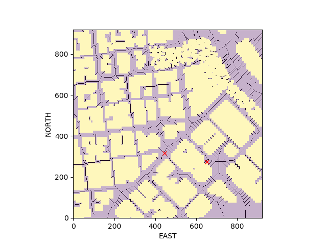
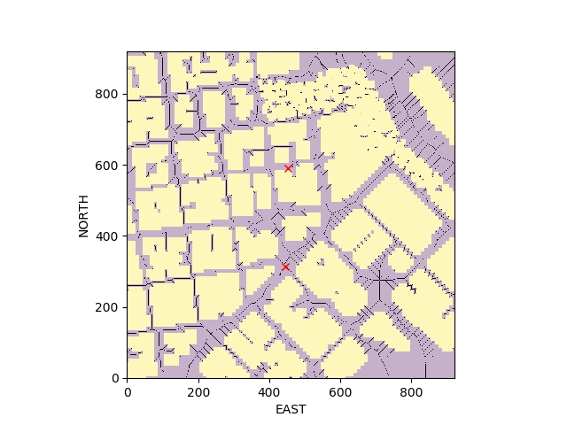
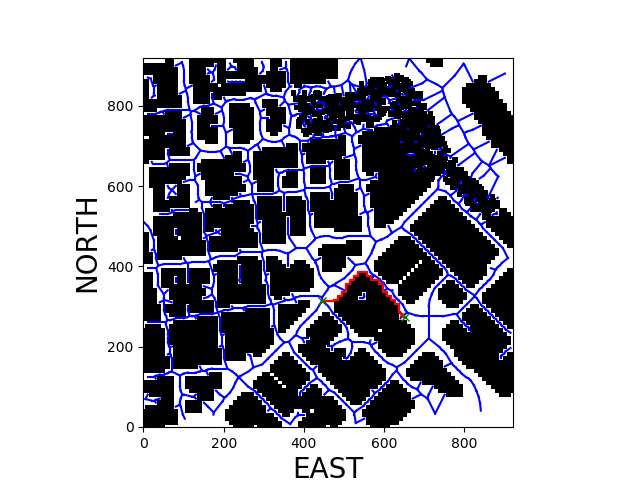
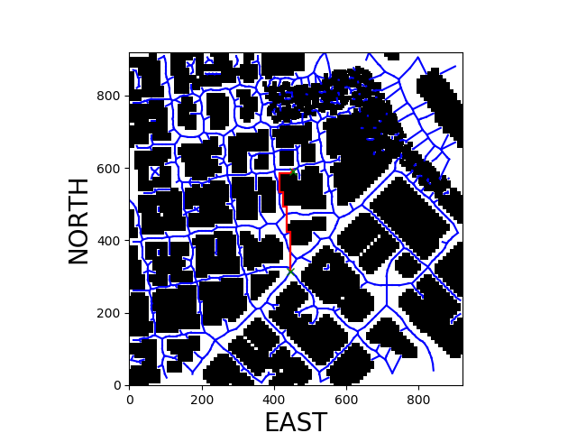
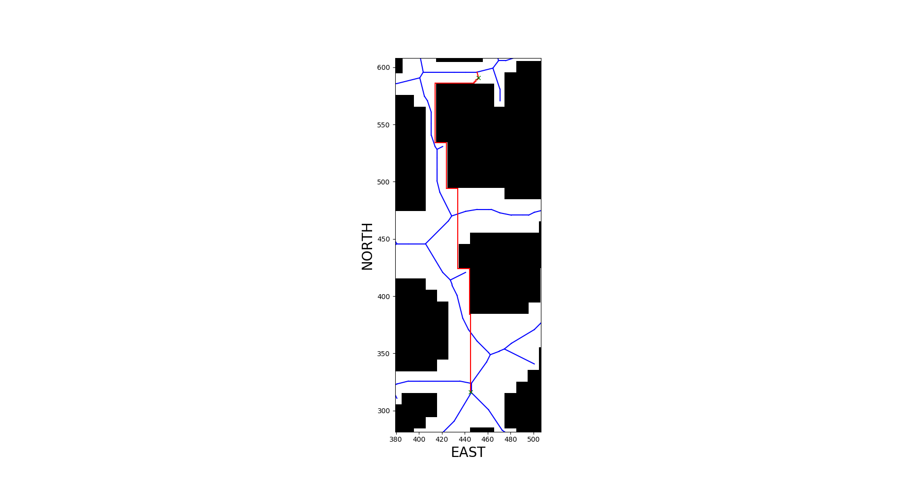

## Project: 3D Motion Planning

---

# Required Steps for a Passing Submission:
1. Load the 2.5D map in the colliders.csv file describing the environment.
2. Discretize the environment into a grid or graph representation.
3. Define the start and goal locations.
4. Perform a search using A* or other search algorithm.
5. Use a collinearity test or ray tracing method (like Bresenham) to remove unnecessary waypoints.
6. Return waypoints in local ECEF coordinates (format for `self.all_waypoints` is [N, E, altitude, heading], where the drone’s start location corresponds to [0, 0, 0, 0].
7. Write it up.
8. Congratulations!  Your Done!

## [Rubric](https://review.udacity.com/#!/rubrics/1534/view) Points
### Here I will consider the rubric points individually and describe how I addressed each point in my implementation.  

---
### Writeup / README

#### 1. Provide a Writeup / README that includes all the rubric points and how you addressed each one.  You can submit your writeup as markdown or pdf.  

You're reading it! Below I describe how I addressed each rubric point and where in my code each point is handled.

### Explain the Starter Code

#### 1. Explain the functionality of what's provided in `motion_planning.py` and `planning_utils.py`
These scripts contain a basic planning implementation that includes code to make grid and to find the path.

And here's a lovely image of my results (ok this image has nothing to do with it, but it's a nice example of how to include images in your writeup!)

### Implementing Your Path Planning Algorithm

#### 1. Set your global home position
I opened the csv file to get the value of latitude and longitude. these are on first line as string. So I split and cut the string to get numbers. finally I change the number to floating type.
Next, I use the self.set_home_position() method to set global home.

And here is a lovely picture of our downtown San Francisco environment from above!

#### 2. Set your current local position
I use the  global_to_local() method to change global postion to local postion of (North, East , Down)

Meanwhile, here's a picture of me flying through the trees!

#### 3. Set grid start position from local position
I tried two algorithms to make grid. First one is medival. The other is Graph Search.
I got the good flying result from medival. but I couldn't get flight from Graph Search because connection is lost from simulator, TIMEOUT. I think Graph Search computation time is longer than timeout.

#### 4. Set grid goal position from geodetic coords
This step is to add flexibility to the desired goal location. Should be able to choose any (lat, lon) within the map and have it rendered to a goal location on the grid.
I choose two positions to test. I got the gps location from this web site : https://www.gps-coordinates.net/

 

 

#### 5. Modify A* to include diagonal motion (or replace A* altogether)
I changed the cost function from one increasement to sqrt(2). I compare the result of them.
At the case of Cost:One, I got the total cost of 344 and at the case of Cost:sqrt(2), I got the 275.
The case of Cost:sqrt(2) is lower than Cost:One.
But, from the below pictures, I don't think lower cost means the better path. Look those pictures and compare them.
I think CostOne is better than CostSqrt(2) at the start region and CostSqrt(2) is better than CostOne at the goal region.

 

#### 6. Cull waypoints 
I use the collinearity_prune() method to reduce unnecessary waypoints. When I didn't use it. flying car moves step by step.

### Execute the flight
#### 1. Does it work?
It works!

### Double check that you've met specifications for each of the [rubric](https://review.udacity.com/#!/rubrics/1534/view) points.
  
# Extra Challenges: Real World Planning

For an extra challenge, consider implementing some of the techniques described in the "Real World Planning" lesson. You could try implementing a vehicle model to take dynamic constraints into account, or implement a replanning method to invoke if you get off course or encounter unexpected obstacles.

